# Definición del producto DIGITAL: 💻


## Investigación UX: ✏️
 
Es una página web que permite al usuari@ (entre nuevos y experimentados), poder filtrar y ordenar una lista de campeones de **League of Legends** para seleccionar uno en específico y ver sus estadísticas generales (more stats) y principales (ataque, defensa, magia y dicultad), 
todo esto con el objetivo de tener un campeón con mayor ventaja que otro.[Planning 👉Trello](https://trello.com/b/ZbxxiHvY/datalovers)
                                             

`¿Quienes son los principales usuarios del producto?`
<br>
Jugador@s de esports (deporte electrónico) que no conocen el juego, entre 10 y 30 años de edad (no excluyente) 
interesados en el modo de juego MOBA (Multiplayer Online Battle Arena).

`¿Cuáles son los objetivos de estos usuarios en relación con el producto?`
<br>
El objetivo de estos invocadores (usuarios dentro del juego) es poder conocer las diferentes estadísticas de los más de 140 campeones del juego,
para crear estratégias que les permita llevarse la victoria en la grieta (campo de batalla).

`¿Cuáles son los datos mas importantes que quieren ver en la interfaz y por qué?`
<br>
*Poder ver a los campeones por imagen y ver sus atributos principales<br>
* Una barra de navegación para filtrar y ordenar la vista de la lista de campeones.<br>
*Información estadística de los campeones, tales como su ataque, defensa, armadura, maná, poder de habilidad (mágia), entre otros. <br>
* Un promedio de las estadísticas por rol para que el usuario pueda identificar las fortalezas y debilidades de cada clase. <br>

`¿Cuáles son los objetivos de estos usuarios en relación con el producto?`
<br>
Su objetivo es tener la información mas completa del juego y sus personajes para seleccionar un campeón que se adecue mas a sus gustos para iniciar el juego.

`¿Cuándo utilizan o utilizarían el producto?`
<br>
A la hora de planear una estrategia de juego, para conocer mejor a su campeón y poder acceder a los datos de sus counters, (campeones enemigos) y como hacen sinergia distintos campeones para conformar el mejor equipo. Los usuarios suelen buscar las estadisticas del equipo enemigo cuando estamos en pantalla de carga, antes de iniciar la partida.

***************************************
```js
HISTORIA DE USUARIO 1 (H.U.1): 
```

**HU1**: Pantalla de inicio : COMO jugador@ de lol QUIERO leer una breve descripción del juego e ingresar mi nombre, PARA sentir la 
experiencia más personalizada y tener una idea general de que trata el juego.

**Criterios de aceptación:** 🤔
<br>
-Que el usuario visualice una pantalla de inicio.<br>
-Que el usuario pueda ingresar su nombre en un campo (input).<br>
-Que el usuario pueda darle click a un botón que lo dirija a una siguiente pagina donde vera un listado de campeones.

**Definición de terminado:** ✔ 
<br>
-Hacer test<br>
-Pagina responsive .<br>
-Usar lint para evaluación de código (correcciones de sintaxis).<br>
-Subir a github <br>
-Desplegar en Github pages.<br>


**Testing con usuarios** :

1. Al inicio no entendían (como figura en la primera HU) que era LOL.
2. Resaltaron no entender que era un invocador (por lo que cambiamos el término como 'ingrese su nombre') 
3. Resaltaron no ver un botón de start, y no entendían el botón de listado de campeones por lo que optamos
   en colocar un solo botón de start que los dirija a otra página donde en una etiqueta se dijera que elijan a un 
   campeón.
4. El testing de la primera HU pasó testing de la mayoría de usuarios.

## Prototipado BAJA FIDELIDAD 
[VER 👉 INVISION](https://mararodriguez597039.invisionapp.com/freehand/datalovers-lol-AYIeTKBpY?v=X6JP0IPtqctW100IADvc3w%3D%3D&linkshare=urlcopied)


## Prototipado ALTA FIDELIDAD 
[VER 👉 FIGMA](https://www.figma.com/file/lr2q13Jdqztgdy6ag3oV7a/Untitled?node-id=77%3A177)


**********************************
```js
HISTORIA DE USUARIO 2 (H.U.2):
```

**HU2**:  Visualizar lista de campeones : Como jugador@ de lol quiero visualizar una lista de campeones para ver todos los campeones disponibles por nombre en orden alfabético y al reverso (de la Z a la A)

**Criterios de aceptación:** 🤔<br>

-Visualizar una lista de campeones con su nombre e imagen<br>
-Se organizan todos los campeones en orden alfabético de la A a la Z  <br>
-Se organizan todos los campeones de la Z a la A <br> 
-Tiene la vista de la barra de búsqueda: icono de buscar por nombre, por  clases 
 por nivel de dificultad y el ícono de sort (ordenar A-Z Z-A)  (sin funcionalidad)<br>


**Definición de terminado:** ✔ <br>

-Hacerle testing al resultado (Pruebas unitarias)<br>
-Pagina responsive<br>
-Usar slint para evaluación de código.<br>
-Refactorizar <br>
-Subir a github <br>
-Desplegar en Github pages.<br>


**Testing con usuarios** :

1. Les gusto el despliegue, nos recomendaron disminuir tamaño de letra 

## Prototipado BAJA FIDELIDAD 


## Prototipado ALTA FIDELIDAD 


**********************************
```js
HISTORIA DE USUARIO 3 (H.U.3):
```

**HU3**: Como jugador@ de lol Quiero poder hacer un hover un champ de la lista de campeones Para poder ver un card con la información básica del campeón

**Criterios de aceptación:** 🤔<br>

-El usuario puede ver un card de campeón al hacer hover<br>
-Realizar el boton de "ver más"(solo css)<br>

**Definición de terminado:** ✔ <br>

-Hacerle testing al resultado (Pruebas unitarias)<br>
-Usar slint para evaluación de código..<br>
-Refactorizar <br>
-Subir a github <br>
-Desplegar en Github pages.<br>

## Prototipado ALTA FIDELIDAD 


**********************************
```js
HISTORIA DE USUARIO 4 (H.U.4):
```

**HU4**: Como jugador@ de lol Quiero poder buscar a un champ por su nombre Para acceder mas rapido a la informacion que quiero ver

**Criterios de aceptación:** 🤔<br>

-El usuario puede buscar por nombre de campeón<br>
-Hacer que se actualice la lista con cada carácter colocado en la barra de búsqueda<br>
-Que le dé un mensaje de error al usuario si el input no coincide con ninguna búsqueda<br>
-Función filtrar por nombre<br>

**Definición de terminado:** ✔ <br>

-Hacerle testing al resultado.<br>
-Usar slint para evaluación de código.<br>
-Refactorizar. <br>
-Subir a github. <br>
-Desplegar en Github pages.<br>

**Testing con usuarios** :
1. No sugirieron colocar un champion not found.<br>

## Prototipado ALTA FIDELIDAD 

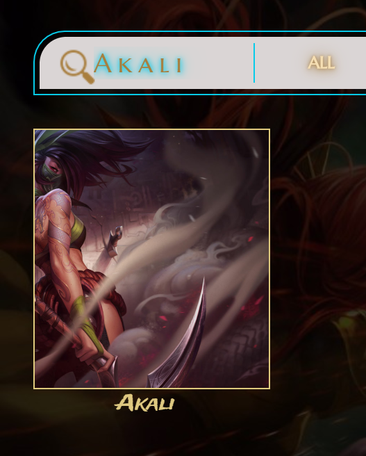


**********************************
```js
HISTORIA DE USUARIO 5 (H.U.5):
```

**HU5**:YO como jugador@ de lol quiero poder filtrar por dificultad para saber cuántos campeones hay disponibles por cada dificultad

**Criterios de aceptación:** 🤔<br>

-Función filtrar por dificultad<br>
-Al presionar la barra donde dice "seleccionar la dificultad" se despliegan las opciones<br>
-Se organiza la lista de campeones por dificultad<br>

**Definición de terminado:** ✔ <br>

-Hacerle testing al resultado.<br>
-Usar slint para evaluación de código.<br>
-Refactorizar. <br>
-Subir a github. <br>
-Desplegar en Github pages.<br>

**Testing con usuarios** :

1. Consideraron que sería mejor si fuera una sola barra.
2. Nos sugieron el color de shadow.

## Prototipado ALTA FIDELIDAD 

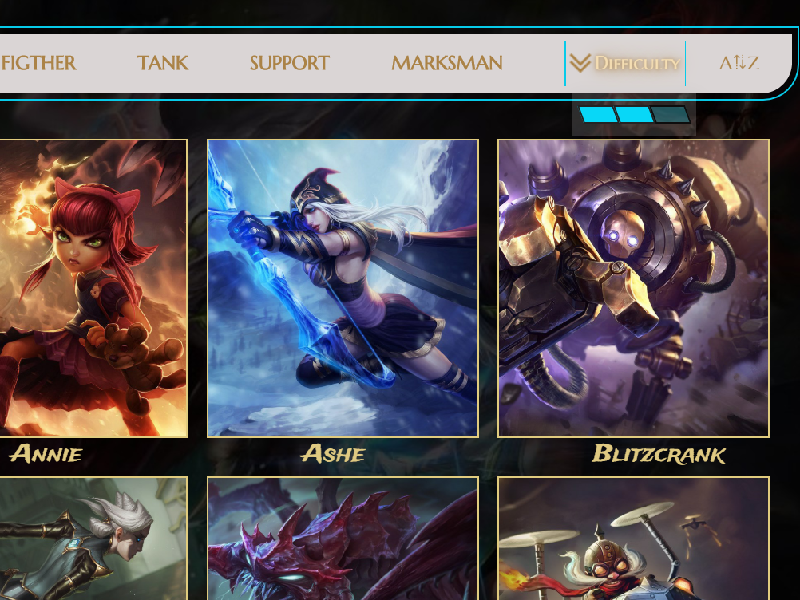


**********************************
```js
HISTORIA DE USUARIO 6 (H.U.6):
```

**HU6**: Como jugador@ de lol quiero poder filtrar por clase de campeón para elegir con que tipo de juego me siento afín.

**Criterios de aceptación:** 🤔<br>

-Visualizar una lista de campeones con su nombre e imagen por rol<br>
-Se organizan todos los campeones en orden a su clase al darle click a un boton del navbar <br>

**Definición de terminado:** ✔ <br>

-Hacerle testing al resultado.<br>
-Usar slint para evaluación de código.<br>
-Refactorizar <br>
-Subir a github <br>
-Desplegar en Github pages.<br>

## Prototipado ALTA FIDELIDAD 

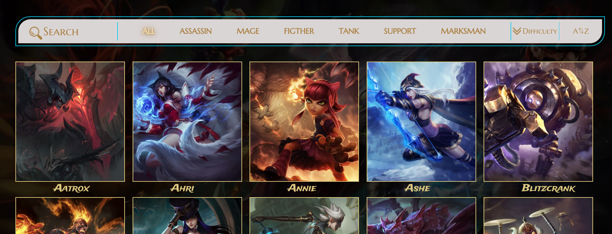


**********************************
```js
HISTORIA DE USUARIO 7 (H.U.7):
```

**HU7**:  Como usuari@ quiero poder ordenar a los campeones de la A-Z y de la Z a la A para tener más opciones de búsqueda en la página.

**Criterios de aceptación:** 🤔<br>

-Función sort para devolver el arreglo "ordenado"<br>
-Función reverse para devolver la función ordenada al revés<br>
-Se visualiza un dropdown con las opciones<br>

**Definición de terminado:** ✔ <br>

-Hacerle testing al resultado (Pruebas unitarias)<br>
-Usar lint para evaluación de código (correcciones de sintaxis).<br>
-Refactorizar <br>
-Subir a github <br>
-Desplegar en Git hub pagues.<br>


## Prototipado ALTA FIDELIDAD 


********************************
```js
HISTORIA DE USUARIO 8 (H.U.8):
```

**HU8**:  Como jugador quiero 2 botones uno de jugar y otro par saber mas del campeón elegido

**Criterios de aceptación:** 🤔<br>
-El usuari@ tiene dos botones uno de play y otro de more stats para saber más estadísticas de su campeon<br> 
-Utilizar Html semántico.<br>
-Utilizar manipulación de DOM para creacion del card.
-Usar funciones para el dinamismo y mostrar las estadísticas a traves de la data.
-El usuario visualiza un modal con todas las estadísticas de su campeón.
-El usuario ve un botón X para retornar a la página anterior<br>


**Definición de terminado:** ✔ <br>

-Hacer test<br>
-Usar slint para evaluación de código.<br>
-Refactorizar <br>
-Subir a github <br>
-Desplegar en Git hub pagues.<br>

 Prototipo incial no aplicado!

**Testing con usuarios** :

1. Nos indicaron cambiar el color de letra<br> 
2. Nos indicaron colocar los botones menos grandes<br>
3. Entendieron el dinamismo hacia el modal<br> 
4. Nos pidieron aumentar el tamaño del boton x de retorno<br>

## Prototipado ALTA FIDELIDAD Protitpo aplicado!

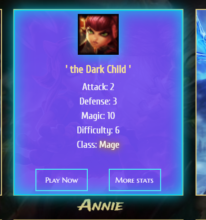

********************************
```js
HISTORIA DE USUARIO 9 (H.U.9):
```

**HU9**:  Como jugador de lol quiero ver paginas de builds para saber como jugar al campeón

**Criterios de aceptación:** 🤔<br>

-Hay una barra con opciones para páginas de builds de campeones<br>
-El usuario al darle click se redigirá a dichas páginas<br>


**Definición de terminado:** ✔ <br>

-Página responsive.<br>
-Usar slint para evaluación de código.<br>
-Subir a github. <br>
-Desplegar en Github pages.<br>

**Testing con usuarios** :

1. Nos sugirieron ponerle una linea que diferencia el titulo de los li con los links<br> 

## Prototipado ALTA FIDELIDAD 

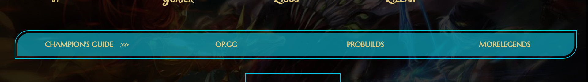

********************************
```js
HISTORIA DE USUARIO 10 (H.U.10):
```

**HU10**:  Como jugador@ de lol quiero tener la opción de ver más estadísticas para tener información más detallada del campeón

**Criterios de aceptación:** 🤔<br>

-El usuario visualiza un modal al darle click al botón "more stats" con estadísticas adicionales<br>
-Se despliega y encuentra 2 botones uno de play y una x para retornar<br>


**Definición de terminado:** ✔ <br>

-Pagina responsive.<br>
-Usar lint para evaluación de código.<br>
-Refactorizar <br>
-Subir a github <br>
-Desplegar en Github pages.<br>

## Prototipado ALTA FIDELIDAD 

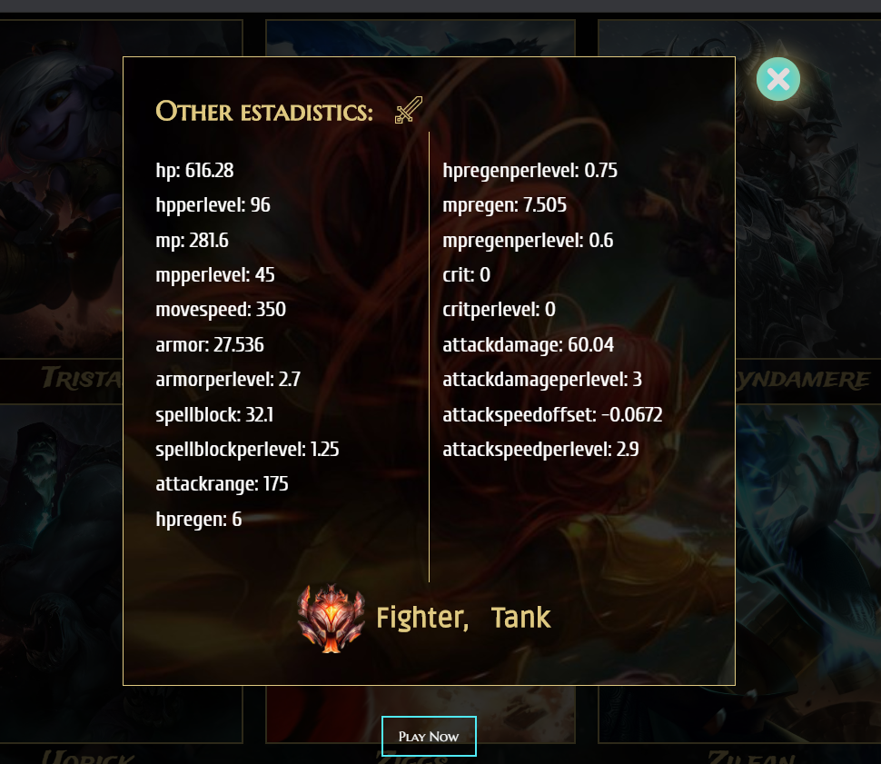

********************************
```js
HISTORIA DE USUARIO 11 (H.U.11):
```

**HU11**:  YO como usuari@ nuev@ quiero que mi nombre aparezca al inicio de la página para sentir que estoy en sesión.

**Criterios de aceptación:** 🤔<br>

-Que el usuario visualice su nombre al cargar la segunda interfaz permanentemente<br>


**Definición de terminado:** ✔ <br>

-Usar lint para evaluación de código.<br>
-Subir a github <br>
-Desplegar en Git hub pagues.<br>


**Testing con usuarios** :

1. Hicimos esta parte por sugerencia de una compañera<br>

## Prototipado ALTA FIDELIDAD 

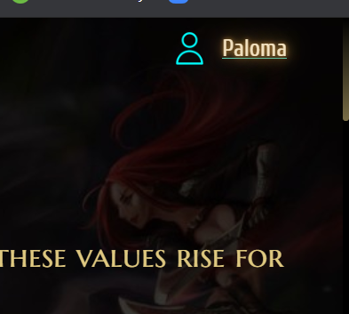

********************************
```js
HISTORIA DE USUARIO 12 (H.U.12):
```

**HU12**: YO como usuari@ quiero tener un boton que me dirija a la parte superior cuando haya bajada hasta abajo para sentirme mas cómod@ al darle click y que suba automáticamente.

**Criterios de aceptación:** 🤔<br>

-Que el usuario visualice el boton up al bajar desde la segunda interfaz permanentemente<br>

**Definición de terminado:** ✔ <br>

-Pagina responsive.
-Usar lint para evaluación de código <br>
-Subir a github <br>
-Desplegar en Github pages.<br>

**Testing con usuarios** :

1. Hicimos este boton up por sugerencia en un feedback con una compañera<br>

## Prototipado ALTA FIDELIDAD 

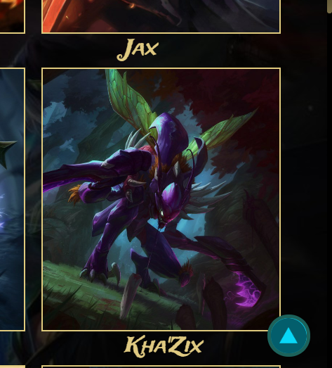

********************************
```js
HISTORIA DE USUARIO 2 (H.U.13):
```

**HU13**: Como usuari@ de lol quiero poder ver una pantalla con los promedios estadísticos de campeones por clase para saber como es el promedio por rol.

**Criterios de aceptación:** 🤔<br>

-Se visualiza un ícono por cada clase<br>
-Al clickear un ícono, se despliega información sobre el rol elegido<br>
-Se muestra una definición de la clase, un slider de imágenes y los promedios de las estadísticas principales para determinar las fortalezas y debilidades de cada rol<br>
-Hacer función reduce por cada rol<br>

*Definición de terminado:** ✔ <br>

-Realizar test unitarios.
-Pasar Eslint
-Hacer commit al master
-Hesplegar en gb pages.

## Prototipado BAJA FIDELIDAD 

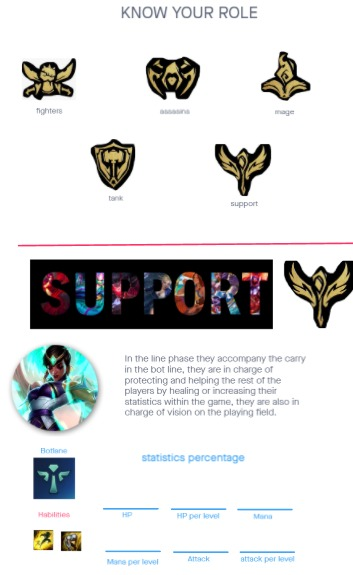

**FEEDBACK de las coaches** : 
1. Testear el diseño de prototipos con usuarios. <br>
2. Usar checklist en trello. <br>
3. Definir mejor la definición de terminado.<br>
4. Separar en dos HU los estilos de CSS de las funciones JS.<br>
5. Replantearnos los test. (no calcular por lenght) <br>
6. Hacer testing de función map. <br>
7. Refactorizar archivos para evitar código repetitivo. <br>
8. Mejorar el uso del HTML semántico. <br>
9. Colocar el alt a las etiquetas img. <br>
10. Nos ayudaron con las lineas sin cubrir de los test. <br>
11. Usar método reduce para el cálculo agregado.

## Prototipado ALTA FIDELIDAD


******************************** 

```js
RESPONSIVE DESKTOP (ALL DEVICES SCREENS): 
```
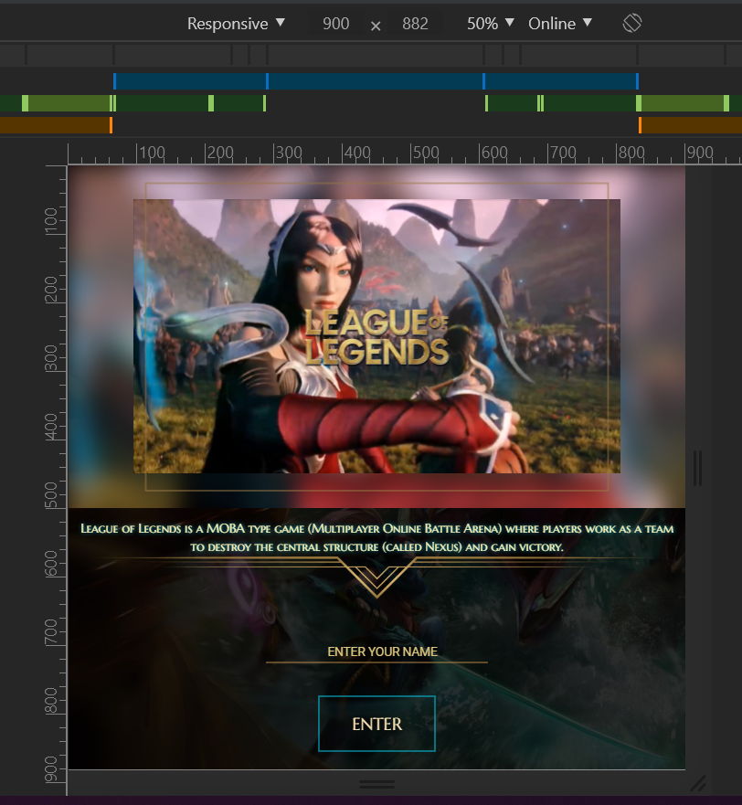
******************************** 
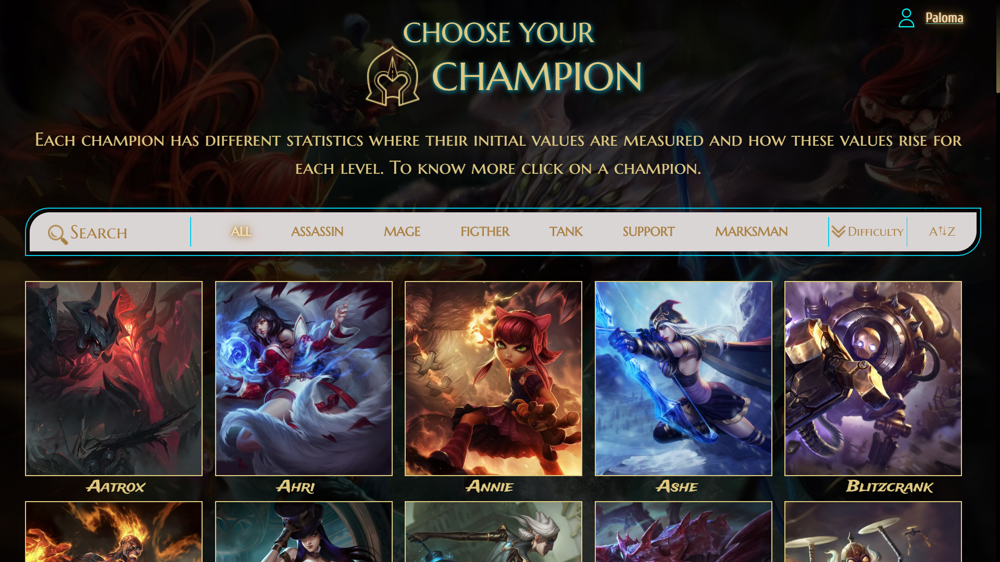

```js
RESPONSIVE IPHONEX IPAD-PRO ( & ALL DEVICES SCREENS):
```
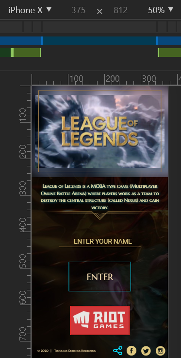
******************************** 
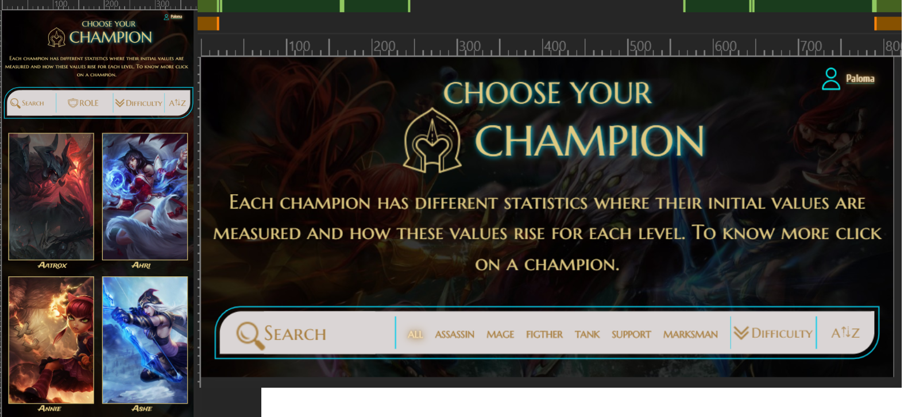
******************************** 
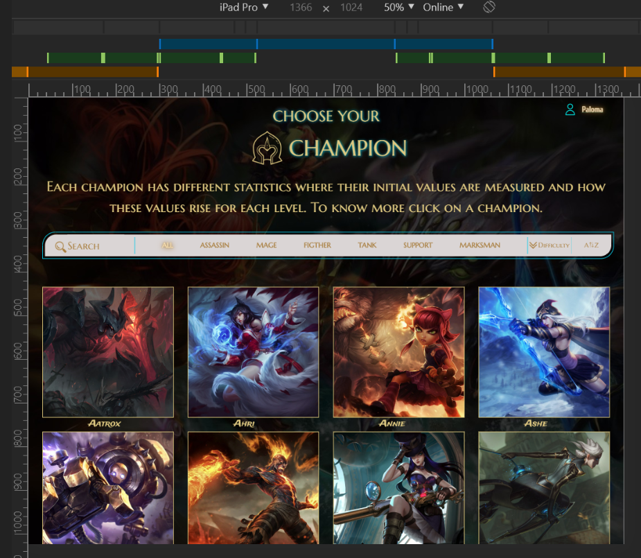
******************************** 
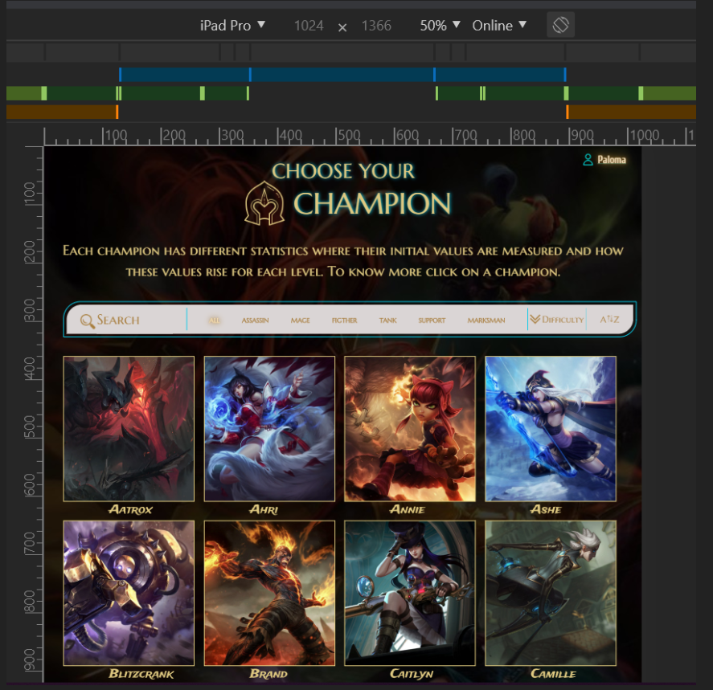
******************************** 

 <!-- Tipos de letras
- font-family: 'Cuprum', sans-serif;
- font-family: 'Trade Winds', cursive;
- font-family: 'Marcellus SC', serif;
- font-family: 'Roboto', sans-serif;
-font-family: 'Ruda', sans-serif;
Colores establecidos:
- celeste #07CBE9
- morado 9B51E0
- inputs casi blanco EEEAEA
- dorado LOL #B48643
<iframe width='560' height='315' src='https://www.youtube.com/embed/A-wez_wSWEA?controls=0' frameborder='0' allow='accelerometer; autoplay; encrypted-media; gyroscope; picture-in-picture' allowfullscreen></iframe> 
https://www.youtube.com/watch?v=A-wez_wSWEA&feature=youtu.be -->
<!-- Invision https://mararodriguez597039.invisionapp.com/freehand/datalovers-lol-AYIeTKBpY?v=X6JP0IPtqctW100IADvc3w%3D%3D&linkshare=urlcopied
Links FIGMA https://www.figma.com/file/lr2q13Jdqztgdy6ag3oV7a/Untitled?node-id=77%3A177
TRELLO : https://trello.com/b/ZbxxiHvY/datalovers -->


